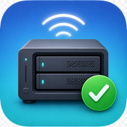

<p align="center">
  
</p>

# NAS Mounter

A tiny macOS menu bar app that keeps your NAS (SMB) shares permanently mounted — so Time Machine backups and anything else relying on network volumes "just work" without manual reconnecting.

## What it does

- **Mounts at login/startup** — enable "Launch at login" in Settings.
- **Remounts after wake from sleep** — listens for system wake and screen-unlock events, with a delayed retry to allow Wi-Fi/Ethernet to come back first.
- **Remounts when the network returns** — watches network reachability and reacts to offline → online transitions.
- **Watchdog** — every 60 seconds it verifies every enabled share is mounted and silently remounts anything that dropped.
- **Keychain-backed credentials** — passwords are stored in your macOS Keychain, never in plain text. Mounting never pops up a password dialog.
- **All macOS network protocols** — SMB (default/recommended), AFP, NFS, WebDAV (http/https), and FTP. Just pick the protocol per share in Settings.

## Build

```bash
./build_app.sh
cp -R "build/NAS Mounter.app" /Applications/
open "/Applications/NAS Mounter.app"
```

Requires Xcode command line tools (Swift 5.9+) and macOS 14+.

## Setup

1. Launch the app — the Settings window opens automatically on first run.
2. Click **Add Share** and enter:
   - **Protocol** — SMB for almost all modern NAS devices (also AFP, NFS, WebDAV, FTP)
   - **Server** — your NAS hostname or IP (e.g. `nas.local`, `192.168.1.10`)
   - **Share** — the share name (e.g. `Media`, `TimeMachine`)
   - **Username / Password** — your NAS credentials (not needed for NFS)
3. Enable **Launch at login**.
4. Click **Save & Mount**.

The menu bar icon shows a checkmark drive when all shares are mounted. Click any share in the menu to mount/unmount it manually.

## Notes

- Shares mount under `/Volumes/<ShareName>` exactly like a Finder mount, so Time Machine, media apps, etc. see them normally.
- Mounts are "soft" so an unreachable NAS won't beachball your Mac.

## Project layout

| File | Purpose |
|---|---|
| `Sources/NASMounter/App.swift` | App entry point (menu-bar-only app) |
| `Sources/NASMounter/AppDelegate.swift` | Status item, menu, settings window |
| `Sources/NASMounter/MountManager.swift` | NetFS mounting/unmounting, mounted-state detection |
| `Sources/NASMounter/EventMonitor.swift` | Wake/network/unlock listeners + watchdog timer |
| `Sources/NASMounter/ShareConfig.swift` | Share model + persistence |
| `Sources/NASMounter/Keychain.swift` | Password storage |
| `Sources/NASMounter/ShareDiscovery.swift` | Bonjour/network discovery of NAS servers and shares |
| `Sources/NASMounter/SettingsView.swift` | SwiftUI settings UI |
| `build_app.sh` | Builds and ad-hoc signs `NAS Mounter.app` |
